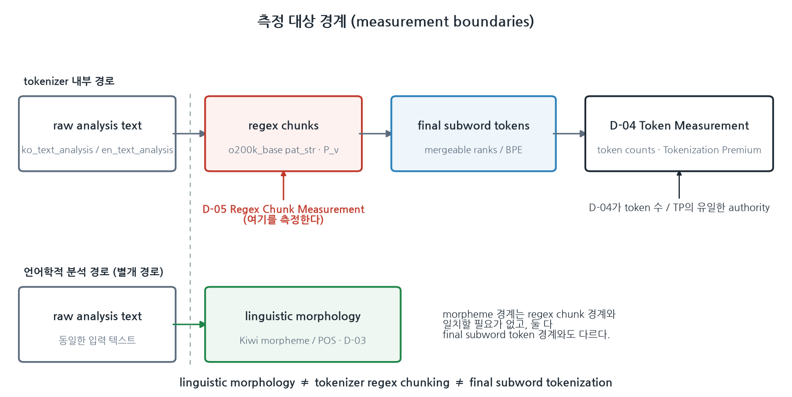
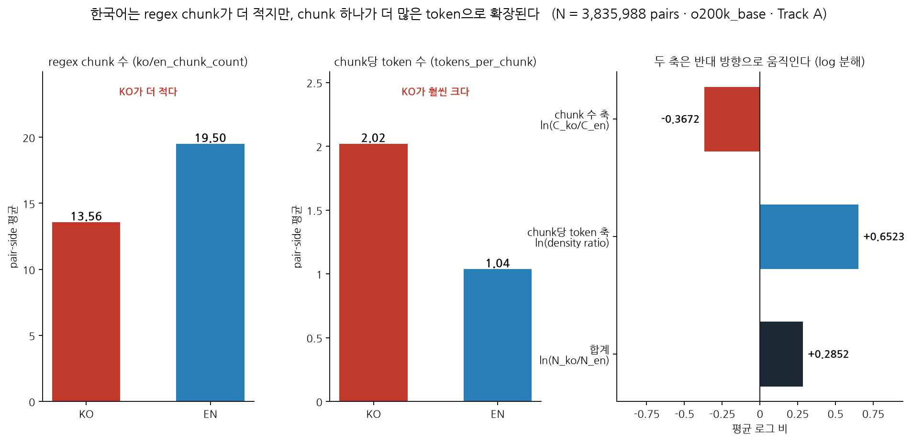
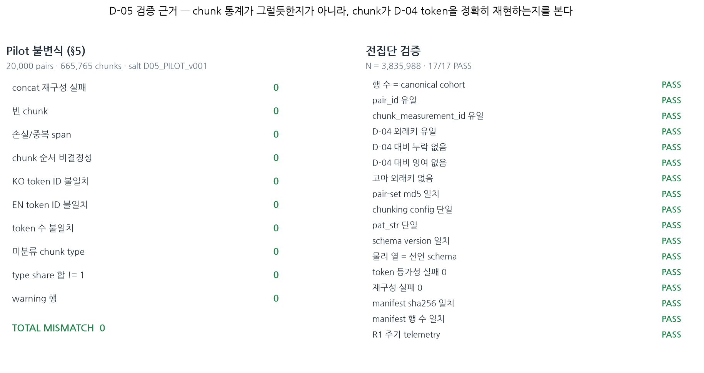
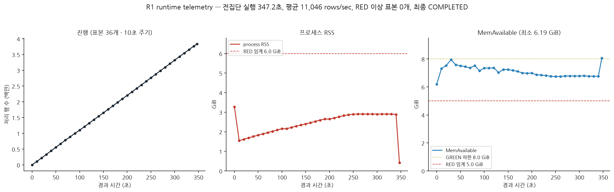

# NB06 / D-05 — o200k_base Regex Chunk Measurement

한국어–영어 의미 대응 3,835,988 pair에서
tokenizer first-stage regex chunking과 final subword expansion의 구조 측정

```
NB06_CLOSED
D05_REGEX_CHUNK_MEASUREMENT_PASS
R1_RUNTIME_OBSERVABILITY_PASS
```

| | |
|---|---|
| Canonical main | `a31a4c27417b93567bb6e261b6225813aaa5f66e` |
| 측정 결과 commit | `c9aa4796f8157b9025deee33ef6504f5921aaf59` |
| Canonical artifact | `data/registry/CHUNK_O200K_BASE_v001.parquet` |
| SHA256 | `bfa98bd6cf7ee8b7254c469aed3e259ce43cc8f0529153347ca4c2c3fc1944ab` |
| 행 / 열 | 3,835,988 / 39 |
| pair-set md5 | `d9660d654ee449e4d0c23a0070225274` |
| Tokenizer | `o200k_base` (tiktoken 0.13.0), Track A |

> **용어 표기 원칙** — 이 패키지의 한국어 문서는 기술 용어를 처음 쓸 때
> `한국어 설명(Original English Term)` 형태로 병기하고, 그 뒤로는 코드 변수명과
> schema field 이름을 **번역하지 않고 원문 그대로** 씁니다.

---

## 1. NB06은 왜 필요한가

이 연구의 1차 질문(RQ1)은 **토큰화 프리미엄(Tokenization Premium, TP)이 존재하는가**였고,
그 답은 D-04 Token Measurement가 냅니다. D-04는 최종 token이 **몇 개** 나오는지를 셉니다.

그런데 "몇 개"만으로는 **어디서** 그 차이가 생기는지 알 수 없습니다.
tokenizer는 텍스트를 한 번에 token으로 바꾸지 않고, 먼저 정규식으로 잘라낸 뒤
그 조각 안에서 subword 병합을 수행합니다. NB06 / D-05는 그 **앞단**을 측정합니다.

D-05는 D-04를 대체하지 않습니다. D-04가 token 수와 TP의 **유일한 authority**이며,
D-05는 그 앞 단계의 mechanism 측정입니다.



```
KO/EN raw analysis text
        │
        ▼
o200k_base pat_str
        │
        ▼
regex chunks                    ←  D-05 Regex Chunk Measurement (여기)
        │
        ▼
BPE / mergeable-rank processing
        │
        ▼
final token IDs
        │
        ▼
D-04 token counts / TP          ←  최종 outcome authority
```

---

## 2. D-04와 D-05는 무엇이 다른가

| | **D-04** Token Measurement | **D-05** Regex Chunk Measurement |
|---|---|---|
| 측정 대상 | 최종 token ID·개수 | regex chunk 경계와 chunk별 token 배분 |
| 권위 | token 수 / TP의 유일한 authority | mechanism 측정. outcome authority 아님 |
| artifact | `TOKEN_O200K_BASE_v001.parquet` | `CHUNK_O200K_BASE_v001.parquet` |
| 포함하는 것 | token ID 배열, `token_premium`, §8 분해항 | chunk 수·바이트 분포·`tokens_per_chunk`·chunk 유형 구성비 |
| 포함하지 **않는** 것 | — | token ID 배열, `token_premium`, §8 분해항 (schema 검사로 강제) |

D-05의 모든 행은 `tokenizer_measurement_id`로 D-04 행에 1:1 연결됩니다.

---

## 3. 절대 혼동하지 않는 세 경계

> **linguistic morphology ≠ tokenizer regex chunking ≠ final subword tokenization**

### 언어학적 형태론(linguistic morphology)

Kiwi 같은 언어학적 분석기(linguistic analyzer)가 찾아내는 morpheme과 POS 구조입니다.
"먹었습니다"를 `먹/VV + 었/EP + 습니다/EF`처럼 문법 단위로 나눕니다.
이 연구에서는 **D-03**이 담당하며, tokenizer와는 무관한 별개 경로입니다.

### tokenizer 정규식 청킹(tokenizer regex chunking)

`o200k_base` tokenizer가 `pat_str`이라는 하나의 정규식으로 raw text를 먼저 자르는
tokenizer 내부 1차 분할입니다. 문법을 전혀 모르며, 문자 종류·공백·구두점 같은
표면 패턴만 봅니다. SSOT §5의 `P_v`가 바로 이 단계이고, **D-05가 측정하는 대상**입니다.

### 최종 subword tokenization

각 regex chunk **내부에서** mergeable ranks(BPE)가 적용되어 최종 token ID가 만들어집니다.
한 chunk가 token 하나가 될 수도, 다섯 개로 쪼개질 수도 있습니다.
이 결과가 **D-04**입니다.

세 경계는 서로 일치할 필요가 없습니다. morpheme 하나가 여러 regex chunk에 걸칠 수도 있고,
regex chunk 하나가 여러 token으로 갈라질 수도 있습니다.

---

## 4. D-05가 정확히 측정한 것

physical schema(39 열)에서 직접 확인한 field입니다. 없는 field는 설명하지 않습니다.

### 식별자 / 연결

| identifier | 설명 |
|---|---|
| `chunk_measurement_id` | D-05 행 식별자 |
| `pair_id` | KO–EN pair 식별자 |
| `tokenizer_measurement_id` | D-04 행으로 가는 외래키(foreign key) |

### 측정값 (KO/EN 각각 `ko_` / `en_` 접두사)

| identifier | 설명 |
|---|---|
| `ko_chunk_count` | 한국어 측 regex chunk 수 |
| `ko_mean_chunk_bytes` | 한국어 측 chunk 평균 UTF-8 byte 길이 |
| `ko_p50_chunk_bytes` | chunk byte 길이의 중앙값 |
| `ko_p90_chunk_bytes` | chunk byte 길이의 90 백분위수 |
| `ko_max_chunk_bytes` | 최대 chunk byte 길이 |
| `ko_tokens_per_chunk` | 한국어 측 chunk 하나당 최종 token 수 |
| `ko_max_tokens_per_chunk` | 한 chunk가 만든 최대 token 수 |
| `ko_chunk_token_total` | chunk에서 나온 token 총합 (D-04 token 수와 일치해야 함) |
| `ko_chunk_byte_total` | chunk byte 총합 (원문 UTF-8 길이와 일치해야 함) |
| `ko_chunk_type_share_letter` | letter 유형 regex chunk 비율 |
| `ko_chunk_type_share_number` | number 유형 비율 |
| `ko_chunk_type_share_punctuation` | punctuation 유형 비율 |
| `ko_chunk_type_share_whitespace` | whitespace 유형 비율 |
| `pair_chunk_ratio` | `ko_chunk_count / en_chunk_count` |

### 설정 고정 / 무결성 flag

`tokenizer_id`, `tiktoken_version`, `pat_str_sha256`, `encoding_file_sha256`,
`chunking_config_sha256`, `chunk_reconstruction_ok`, `token_equivalence_ok`,
`analysis_warning_flag`, `analysis_warning_reason`

**원문(raw text), regex chunk 문자열, token ID 배열은 D-05에 저장하지 않습니다.**
감사가 필요한 사례는 `pair_id`에서 결정적으로 다시 계산할 수 있습니다.

---

## 5. 관찰된 것 (headline descriptive finding)

전집단 N = 3,835,988에서 physical artifact로부터 재계산한 값입니다.



| | KO | EN |
|---|---|---|
| 평균 `chunk_count` (pair-side) | **13.56** | **19.50** |
| 중앙값 `chunk_count` | 11.00 | 15.00 |
| 평균 `tokens_per_chunk` | **2.02** | **1.04** |
| 중앙값 `tokens_per_chunk` | 2.00 | 1.00 |
| 평균 `mean_chunk_bytes` | 8.12 | 4.94 |
| 평균 `p90_chunk_bytes` | 13.96 | 8.81 |
| `chunk_type_share_letter` | 0.8168 | 0.8525 |
| `chunk_type_share_number` | 0.0240 | 0.0149 |
| `chunk_type_share_punctuation` | 0.1477 | 0.1228 |
| `chunk_type_share_whitespace` | 0.0114 | 0.0098 |

관찰된 패턴:

- **한국어 측** — regex chunk 수가 **더 적고**, chunk가 **더 길며**(byte 기준),
  chunk 하나가 **훨씬 많은** 최종 token으로 확장된다.
- **영어 측** — regex chunk 수가 더 많지만, 평균적으로 chunk 하나가
  **거의 token 하나**에 대응한다 (1.04).

허용되는 서술은 여기까지입니다:

> Under the measured `o200k_base` Track A configuration,
> Korean and English exhibit different regex-chunk and tokens-per-chunk profiles.

이 문서 어디에서도 다음과 같이 쓰지 않습니다:
"regex chunking이 TP를 유발한다", "한국어 morphology 때문에 chunk가 이렇게 된다",
"o200k가 한국어를 차별한다".

---

## 6. 왜 이 결과가 흥미로운가

흔한 직관은 이렇습니다.

> "한국어는 정규식 단계에서 더 잘게 쪼개지니까 token이 많아진다."

**측정 결과는 방향이 반대입니다.** 한국어의 regex chunk 수는 오히려 영어보다 적습니다
(13.56 대 19.50, 비 0.71). 어절이 조사·어미까지 붙어 한 덩어리로 남기 때문에
chunk는 더 적고 더 깁니다. 차이는 **그 다음 단계**에서 벌어집니다 — 그 긴 chunk가
subword 병합 과정에서 평균 2.02개의 token으로 갈라집니다.

한 pair의 KO/EN token 수 비는 두 항의 곱으로 **정확히** 분해됩니다:

```
ln(N_ko / N_en) = ln(C_ko / C_en) + ln( (N_ko/C_ko) / (N_en/C_en) )
                      chunk 수 축          chunk당 token 수 축
```

전집단 평균:

| 항 | 값 | 방향 |
|---|---|---|
| `ln(C_ko/C_en)` — chunk 수 축 | **−0.3672** | KO에 chunk가 더 적다 |
| `ln(density ratio)` — chunk당 token 축 | **+0.6523** | KO chunk가 더 잘게 쪼개진다 |
| 합계 `ln(N_ko/N_en)` | **+0.2852** | |

항등식이므로 이 자체는 새로운 주장이 아닙니다. 유용한 점은 두 항의 **부호가 반대**라는
사실입니다 — 한쪽이 다른 쪽을 상쇄하고 있으므로, 최종 token 수 차이를 이해하려면
"chunk가 몇 개 생기는가"와 "각 chunk가 얼마나 확장되는가"를 **분리해서** 봐야 합니다.
항등식의 수치적 잔차는 최대 `4.7e-16`로 닫힙니다.

이것은 NB09 M3 이전의 **descriptive mechanism observation**입니다.

---

## 7. 왜 이 측정을 신뢰할 수 있는가



### 핵심 불변식 (invariant)

chunk 통계가 "그럴듯해 보인다"는 것은 근거가 아닙니다. D-05가 D-04를 실제로 설명하는지는
다음 등식이 성립하는지로 판정합니다:

```
flatten( encode(chunk_1), encode(chunk_2), ..., encode(chunk_K) )
        ==
D-04에 저장된 token ID 배열
```

즉 chunk를 하나씩 따로 인코딩해 이어붙인 결과가, D-04가 전체 텍스트를 한 번에 인코딩해
저장해 둔 token ID 열과 **완전히 같아야** 합니다. 이것이 성립하지 않으면 D-05의 chunk는
D-04와 무관한 별개 측정이 되어버립니다.

### Pilot (N = 20,000 pairs, 665,765 chunks)

| 불변식 | 위반 |
|---|---|
| concat 재구성 실패 | 0 |
| 빈 chunk | 0 |
| 손실/중복 span | 0 |
| chunk 순서 비결정성 | 0 |
| KO token ID 불일치 | 0 |
| EN token ID 불일치 | 0 |
| token 수 불일치 | 0 |
| 미분류 chunk type | 0 |
| type share 합 ≠ 1 | 0 |
| warning 행 | 0 |

### 전집단 검증 (N = 3,835,988) — 17/17 PASS

행 수 = canonical cohort · `pair_id` 유일 · `chunk_measurement_id` 유일 ·
D-04 외래키 유일 · D-04 대비 누락 0 · D-04 대비 잉여 0 · 고아 외래키 0 ·
pair-set md5 일치 · chunking config 단일 · `pat_str` 단일 · schema version 일치 ·
물리 열 = 선언 schema · token 등가성 실패 0 · 재구성 실패 0 ·
manifest sha256 일치 · manifest 행 수 일치 · R1 주기 telemetry

### 노트북 독립 재검사

`notebooks/06_regex_chunk_audit.ipynb`는 pilot과 **다른 salt**(`NB06_LIVE_CHECK_v001`)로
3,000 pair를 새로 뽑아 여섯 불변식을 **다시 계산**합니다. 98,222 chunk에서 위반 0.
pilot이 자기 표본을 다시 승인하는 구조가 아닙니다.

---

## 8. 재현성

세 번의 독립 전집단 실행이 **byte 단위로 동일한** artifact를 만들었습니다:

```
bfa98bd6cf7ee8b7254c469aed3e259ce43cc8f0529153347ca4c2c3fc1944ab
```

다만 **"Git checkout만으로 완전히 재현된다"고 말할 수 없습니다.**
`data/registry/*.parquet`는 `.gitignore`로 저장소에서 제외되어 있고, 상류 canonical
artifact(`PAIR_REGISTRY_v002`, `TOKEN_O200K_BASE_v001`)도 로컬에만 존재합니다.

재현 수준은 세 단계로 나뉘며 자세한 절차는 [REPRODUCE.md](REPRODUCE.md)에 있습니다.

| 수준 | 필요한 것 | 결과 |
|---|---|---|
| **LEVEL A** — 문서/figure 재현 | Git checkout만 | 동일한 SVG/PNG hash |
| **LEVEL B** — D-05 검증 재현 | 로컬 `CHUNK_O200K_BASE_v001.parquet` | 17/17 검증 PASS |
| **LEVEL C** — 전집단 재실행 | 로컬 D-04 + pair registry + tiktoken 오프라인 캐시 | 동일한 artifact SHA256 |

---

## 9. 실행 환경과 R1 관측



| 항목 | 값 |
|---|---|
| telemetry 구간 | 347.21 초 |
| stage 전체 구간 | 349.857 초 |
| 평균 처리량 | 11,045.8 rows/sec |
| telemetry 표본 | 36개 (10초 주기) |
| 최소 MemAvailable | 6.188 GiB |
| 최대 프로세스 RSS | 3.28 GiB |
| 실행 구간 RSS 범위 | 1.55 – 2.91 GiB |
| 실행 중 swap delta | 0 MiB |
| RED 이상 표본 | 0개 |
| 최종 상태 | COMPLETED |
| DuckDB | `memory_limit=3GB`, `threads=8`, `batch_rows=2500` |

기록된 최대 RSS 3.28 GiB는 **실행 직전 표본**의 값입니다 — pre-flight 해시 검증이 남긴
잔여 메모리이며, 실제 측정 구간의 RSS는 1.55–2.91 GiB였습니다.

### 실패한 시도도 기록한다

전집단 실행은 처음 두 번 `MemoryGuardAbort`로 중단됐습니다
(`MemAvailable 4.31 GiB < 5.0`, 이어서 `4.67 GiB < 5.0`).

원인은 guard 임계값이 아니라 **`execute_chunk_run`의 DuckDB 연결에 `memory_limit`과
spill 디렉터리가 지정되지 않은 것**이었습니다. D-04와 pair registry를 join한 뒤
`pair_id`로 정렬하는데, 이 행에는 양쪽 token ID 배열과 양쪽 분석 텍스트가 모두 실려 있어
정렬 비용이 큽니다. 한도가 없으면 DuckDB 기본값(RAM의 80%)이 적용되어 telemetry가
시작되기도 전에 여유 메모리를 소진했습니다.

임계값을 낮추는 대신 한도와 spill 경로를 명시했고, 이후 실행은 MemAvailable
6.19–6.5 GiB를 유지하며 완주했습니다.

세 번째 실행 전에 두 건의 guard 결함도 함께 고쳤습니다 — 종료 표본이 이미 완료된 실행을
사후에 실패시키던 문제, 그리고 시스템 전역 swap 카운터의 배경 paging만으로 RED가 찍히던
오탐입니다. 자세한 내용은
[NB06_D05_METHOD_AND_VALIDATION_KO.md](NB06_D05_METHOD_AND_VALIDATION_KO.md)에 있습니다.

---

## 10. D-05가 확립하는 것

- 고정된 `o200k_base` 설정의 regex preprocessing을 실제로 측정했다.
- canonical final cohort **전체**(3,835,988 pair)에서 측정했다.
- KO/EN의 regex chunk profile 차이를 관찰했다.
- 한국어가 **chunk는 더 적고 chunk당 token은 더 많은** 구조임을 관찰했다.
- regex chunk 분할이 D-04의 최종 token ID와 **정확히 호환**됨을 확인했다.

## 11. D-05가 확립하지 **않는** 것

- morphology가 프리미엄을 유발한다 — **아님**
- regex chunking이 TP 전부를 유발한다 — **아님**
- byte encoding이 token premium을 유발한다 — **아님**
- tokenizer 전반의 동작 — **아님** (`o200k_base` Track A 한 설정만 측정)
- 한국어 텍스트 전반 — **아님** (이 cohort에 한정)
- 모델 품질상의 불이익 — **아님** (품질은 측정하지 않았다)
- 인과 mechanism — **아님**

NB09 M3 이전에는 **조건부 설명력 연관(conditional explanatory association)조차
아직 공식 결과가 아닙니다.** 지금 있는 것은 descriptive mechanism measurement입니다.

## 12. 다음 단계

| 단계 | 상태 |
|---|---|
| NB06 / D-05 Regex Chunk Measurement | **DONE** |
| G5 | NEXT |
| NB07 canonical descriptive synthesis | 대기 |
| NB09 M3 — D-05 mechanism block의 conditional explanatory association | 대기 |

---

## 패키지 구성

| 파일 | 내용 |
|---|---|
| [README.md](README.md) | 이 문서 |
| [RESULT_CARD.md](RESULT_CARD.md) | 한 화면 결과 카드 |
| [NB06_D05_INTERPRETATION_KO.md](NB06_D05_INTERPRETATION_KO.md) | 심화 해설 |
| [NB06_D05_METHOD_AND_VALIDATION_KO.md](NB06_D05_METHOD_AND_VALIDATION_KO.md) | 방법론·검증 |
| [REPRODUCE.md](REPRODUCE.md) | 3단계 재현 절차 |
| [data/NB06_D05_VISUAL_DATA_v001.json](data/NB06_D05_VISUAL_DATA_v001.json) | figure 입력 집계값 (원문 없음) |
| [extract_visual_data.py](extract_visual_data.py) | artifact → 집계 JSON |
| [build_nb06_figures.py](build_nb06_figures.py) | 집계 JSON → figure |
| [verify_nb06_d05.py](verify_nb06_d05.py) | 패키지 자체 검증 (실행 시 repro manifest 갱신) |
| [NB06_D05_REPRO_MANIFEST_v001.json](NB06_D05_REPRO_MANIFEST_v001.json) | 패키지 파일 해시 + 재현 수준별 상태 |
| [reproduce.sh](reproduce.sh) | LEVEL A/B 실행 |

figure 이름은 `NB06_D05_Vxx`이며, SSOT §16.2의 canonical `F01`–`F09` 이름은 사용하지
않습니다. 이 figure들은 measurement-result visualization 전용입니다.

---

## Session Freeze — 2026-08-17

```
NB06_CLOSED
D05_REGEX_CHUNK_MEASUREMENT_PASS
R1_RUNTIME_OBSERVABILITY_PASS
PACKAGE_FROZEN_FOR_HANDOFF
```

| | |
|---|---|
| 동결 시점 canonical science main | `a31a4c27417b93567bb6e261b6225813aaa5f66e` |
| NB06 result commit | `c9aa4796f8157b9025deee33ef6504f5921aaf59` |
| Package branch | `results/nb06-d05-reproducibility-20260817` |
| Package content HEAD | `9ed4b799115f7b12994d0b2833e69669714dae24` |
| Package branch tip | 이 freeze checkpoint commit (commit이 자기 SHA를 담을 수 없으므로 handoff 문서와 터미널 보고에 기록) |

**핵심 결과 한 줄**

> 고정된 `o200k_base` Track A에서 한국어 측은 영어 측보다 regex chunk 수는 적지만,
> chunk당 최종 subword token 확장은 훨씬 크게 관찰되었다.

**Claim status**

```
DESCRIPTIVE MECHANISM MEASUREMENT
NOT CAUSAL
```

**Next canonical science stage** — G5 Analysis Readiness.
단, **G5는 이 branch에서 시작하지 않습니다.** 이 branch는 documentation /
result communication 전용이며 동결 상태로 유지됩니다.

동결 시점 검증 결과: `FIGURE_REPRODUCTION=PASS` · `PACKAGE_VERIFICATION=PASS` ·
`D05_VALIDATION=PASS (17/17)` · `LEVEL_C_FULL_REEXECUTION=NOT_RUN`.

세션 종료 인수인계는
[`docs/handoff/2026-08-17_2233_CLAUDE_A_NB06_D05_SESSION_FREEZE.md`](../../handoff/2026-08-17_2233_CLAUDE_A_NB06_D05_SESSION_FREEZE.md)에
있습니다.
