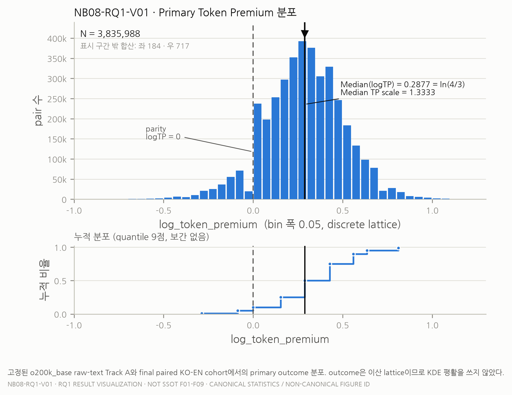
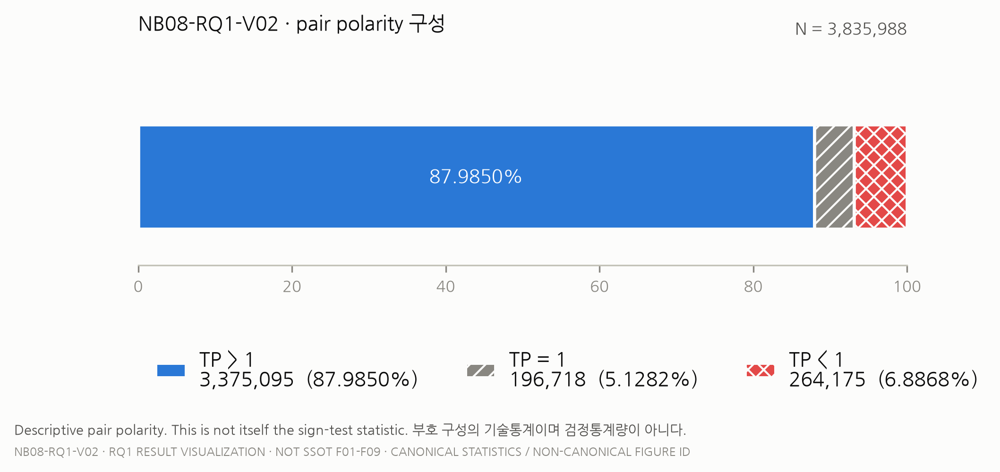
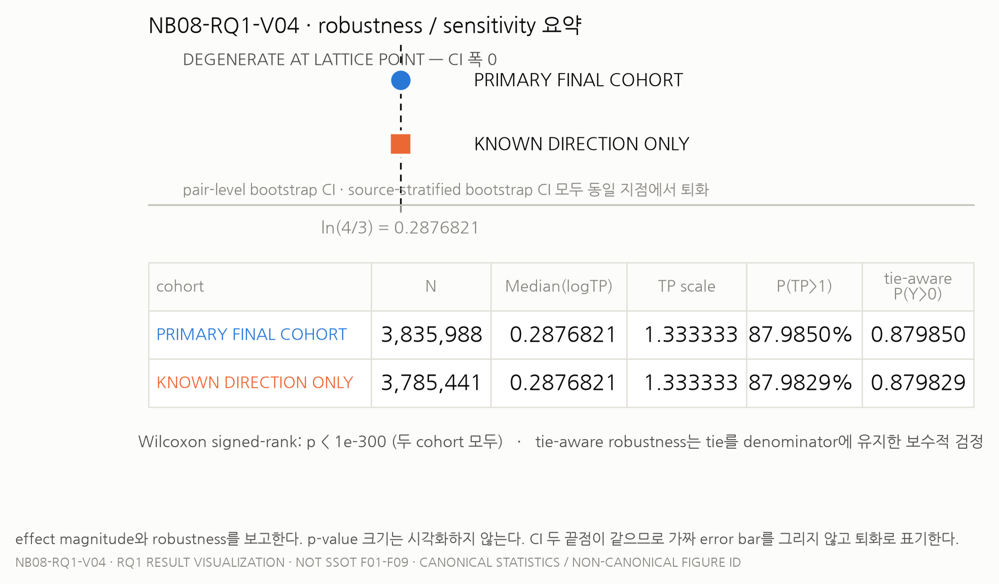
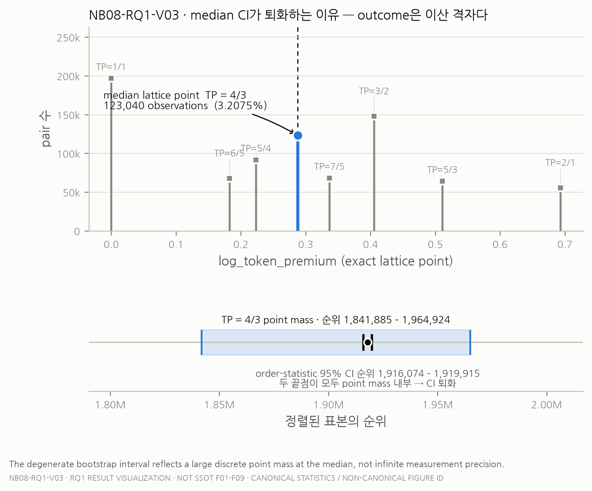
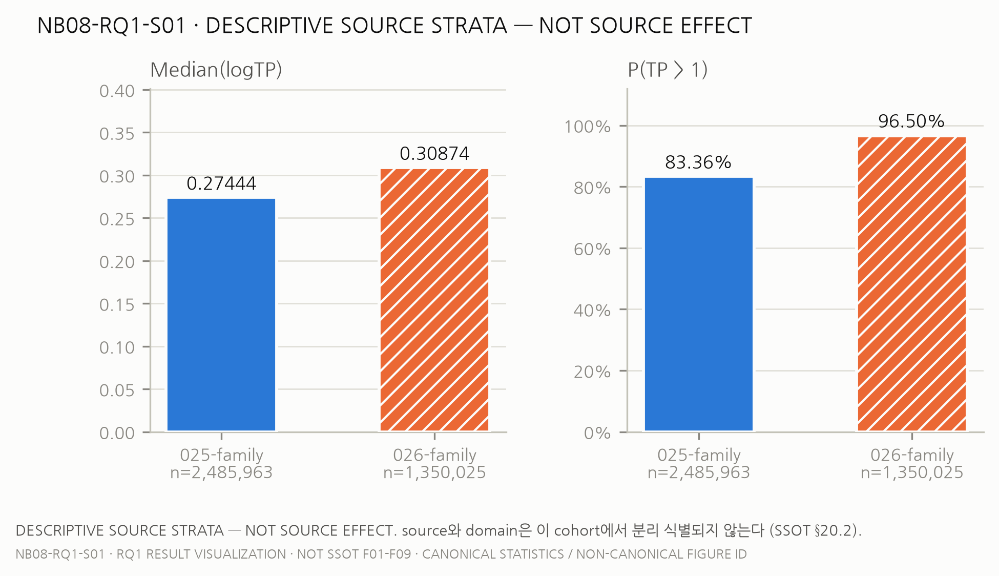

# RQ1 — Korean–English Tokenization Premium under `o200k_base`

**Primary inference over 3,835,988 semantically matched KO–EN pairs**

```
RQ1_PRIMARY_INFERENCE_PASS
NB08_RQ1_CLOSED
```

| | |
|---|---|
| Tokenizer | `o200k_base` (tiktoken 0.13.0) |
| Track | A / raw text |
| Chat serialization | NONE |
| Special tokens | NONE |

> This package is **result communication**, not new inference. Every number here is copied from the
> frozen analysis artifacts listed in [§12 Evidence lineage](#12-evidence-lineage). The figure IDs
> `NB08-RQ1-V01…V04`, `S01` are **not** the SSOT canonical figures `F01`–`F09`, which belong to NB07
> and do not exist yet.

---

## Where should I start?

| I want… | Go to |
|---|---|
| just the result | this file |
| the statistical interpretation, in depth | [`RQ1_INTERPRETATION_KO.md`](RQ1_INTERPRETATION_KO.md) |
| manuscript-ready text | [`RQ1_PAPER_TEXT_EN.md`](RQ1_PAPER_TEXT_EN.md) |
| to reproduce the figures | [`REPRODUCE.md#level-a`](REPRODUCE.md#level-a--figures-only) |
| to re-run the statistics | [`REPRODUCE.md#level-b`](REPRODUCE.md#level-b--full-statistical-re-execution) |
| to inspect the canonical analysis | `notebooks/08_primary_inference.ipynb` |
| the machine-readable result | `ssot_nb01/04_NB08_RQ1_RESULTS_v001.json` |

---

## 1. The research question

For each semantically matched Korean–English pair *i*, let `T_KO,i` and `T_EN,i` be the number of
tokens the fixed tokenizer produces for each side. Define

```
TP_i = T_KO,i / T_EN,i          (Tokenization Premium)
Y_i  = log(TP_i)                (logTP — the primary outcome)
```

RQ1 asks a single question:

> **Is `Median(Y_i) > 0`?**

Reading `TP`:

| | meaning |
|---|---|
| `TP > 1` | the Korean side used **more** tokenizer tokens |
| `TP = 1` | both sides used the **same** number |
| `TP < 1` | the Korean side used **fewer** |

---

## 2. Headline result

```
N                    3,835,988

Median logTP         0.28768207245178085     = ln(4/3)
Median TP scale      1.3333333333333333      = 4/3

P(TP > 1)            87.9850%     (3,375,095 pairs)
P(TP = 1)             5.1282%     (  196,718 pairs)
P(TP < 1)             6.8868%     (  264,175 pairs)
```

> **Under the fixed `o200k_base` raw-text Track A configuration, the median Korean-to-English
> pair-level token-count ratio was 4/3.**

When this is described as a "33.3 % premium", it must be written as a **median pair-level premium**.
It is **not** the aggregate corpus token ratio.



---

## 3. What 1.333 actually means

`TP` is computed **per pair**, then the median is taken across pairs. A generic illustration — not a
sentence from the corpus:

```
English side   3 tokens
Korean side    4 tokens
TP = 4 / 3 = 1.333…
```

Two distinctions that matter:

```
Median(TP)                    ≠    Σ T_KO / Σ T_EN
(the median of per-pair ratios)    (one aggregate ratio over the whole corpus)
```

And `Median(TP) = 1.333` does **not** mean "every Korean sentence uses exactly 33.3 % more tokens".
It means the *middle* pair, when all pairs are ordered by their ratio, sits at 4/3. Individual pairs
range widely on both sides of that value.

---

## 4. The phenomenon is widespread

```
positive   TP > 1     3,375,095
tie        TP = 1       196,718
negative   TP < 1       264,175
```

About **88 %** of pairs have a Korean token count greater than the English one. This matters because
it distinguishes the result from a pattern in which a small number of extreme pairs drags an average
upward — here the direction is shared by the large majority of individual pairs.

This does **not** mean the proportion is identical across every domain or source.



---

## 5. Formal inference

**Primary test** — one-sample Wilcoxon signed-rank, `alternative = greater`, `zero_method = wilcox`.

```
p < 1e-300
```

The exact p-value underflows double precision. A normal-approximation `log10(p)` diagnostic exists in
the artifacts, but it is a distance-from-the-null diagnostic, **not** an exact log p-value, and it is
deliberately not used as a headline number.

**Robustness** — `TIE_AWARE_MEDIAN_SIGN_ROBUSTNESS`, which keeps all 196,718 ties in the denominator
and counts every one of them against the alternative:

```
P(Y > 0)   primary          0.879850
P(Y > 0)   known-direction  0.879829
```

The direction survives both. The conclusion is therefore not an artifact of the zero-handling
convention, and not an artifact of the rows whose translation direction is `UNKNOWN`.



---

## 6. Why the confidence interval collapses

The 95 % percentile bootstrap interval for the median is

```
[0.28768207245178085, 0.28768207245178085]
```

Both endpoints are identical. **This is not zero uncertainty.** The reason is structural:

1. `T_KO` and `T_EN` are integer counts.
2. `TP` is therefore a ratio of integers.
3. `logTP` is not a dense continuous outcome — it lives on a **discrete lattice**.
4. Across `N = 3,835,988` observations there are only **3,725 distinct** `logTP` values.
5. Exactly **123,040 pairs (3.2075 %)** sit at `ln(4/3)`.
6. The sample median rank falls **inside** that large point mass.
7. Every resampled median therefore lands on the same attainable lattice point.

> The degenerate interval reflects discreteness and a large point mass at the sample median, not
> infinite numerical precision.

Two further procedures agree, which is why this is a property of the data rather than of the
bootstrap: an **exact order-statistic interval** (both endpoint ranks land inside the same point
mass) and a **source-stratified bootstrap** (a different resampling design entirely) both return the
same degenerate interval.



---

## 7. Source-stratified sensitivity

```
025-family    median logTP ≈ 0.2744368     P(TP>1) ≈ 83.36%
026-family    median logTP ≈ 0.3087355     P(TP>1) ≈ 96.50%
```

A source-stratified bootstrap that holds the source composition fixed reproduces the same overall
conclusion — it does not reverse.

> ⚠️ **THIS IS NOT A SOURCE EFFECT ESTIMATE.**
> Source and domain are not separately identifiable in this cohort (SSOT §20.2). The stratum
> descriptives above may not be read as a source effect or a domain effect. Estimating those is NB09
> work and has not been done.



---

## 8. What this result establishes

- Under the fixed `o200k_base` tokenizer, raw-text Track A measurement, and the defined final paired
  KO–EN cohort:
  - the pair-level median `logTP` is positive;
  - the median `TP` scale is `4/3`;
  - 87.9850 % of pairs have `TP > 1`;
  - the direction survives the tie-aware conservative test, the known-direction subset, and a
    source-stratified resampling design.

## 9. What this result does **NOT** establish

> It does **not** show that:
>
> - Korean is intrinsically inefficient for AI.
> - All tokenizers behave this way.
> - Morphology causes the premium.
> - UTF-8 directly causes a 33 % premium.
> - Korean reasoning quality is lower.
> - API pricing is universally 33 % higher.
> - Source or domain causes the difference.
> - Every pair has `TP = 1.333`.

The design is paired and observational. No causal claim is supported.

---

## 10. How to read the evidence, in priority order

1. **Median TP scale = 1.333** — the effect magnitude.
2. **P(TP > 1) = 87.99 %** — the prevalence.
3. **Robustness consistency** — tie-aware, known-direction, source-stratified all agree.
4. **CI lattice behaviour** — degenerate because the outcome is discrete.
5. **p-value** — last, and least informative at this sample size.

The result is notable because the effect magnitude, the prevalence of positive pair-level premiums,
and multiple robustness checks all point in the same direction — not because a p-value is small. At
`N ≈ 3.8 M` almost any deviation would be "significant"; significance carries little information here.

---

## 11. What comes next

| RQ | status |
|---|---|
| RQ1 — median logTP > 0 | **DONE** (this package) |
| RQ2 — exact decomposition | canonical interpretation pending NB07 |
| RQ3 — representation association | pending NB09 |
| RQ4 — morphology incremental value | pending NB09 |
| RQ5 — regex chunk mechanism | pending NB06 + NB09 |

Next canonical stage: **NB06 / D-05** (regex chunk measurement).

---

## 12. Evidence lineage

```
main                07d132e924fbd1127897b2e73fb25a22b6f719b3
RQ1 closeout        3f4e8210739205389cfb0c7853f5384015020382
primary result      502bc128f6b5855f1648802cc990b715808f26f3
decision            e72274086a7e9c611c9014e6b5612df0e69dae30
cohort              9b695307c0551be84d4d6c374646bfe001b7b3a9
protocol            86521fdf04839d2e3e8e5db8e15a08ea067871e3

D-04 SHA-256        1c30e3276222dd94885ae4f79fc6ab5c45e4e26226de0afd91fc6b1f7d2c16e7
pair-set hash       d9660d654ee449e4d0c23a0070225274
```

```
Canonical KO–EN cohort
        │
        ▼
D-04 o200k measurement            data/registry/TOKEN_O200K_BASE_v001.parquet
        │
        ├── pair_id
        ├── T_KO   (ko_token_count)
        ├── T_EN   (en_token_count)
        └── logTP  (log_token_premium)
        │
        ▼
Frozen RQ1 cohort                 N = 3,835,988
        │
        ▼
Frozen inference protocol         NB08_RQ1_PROTOCOL_v001
        │
        ├── median(logTP)
        ├── Wilcoxon signed-rank
        ├── pair-level bootstrap          B = 2000, seed 969634713
        ├── tie-aware robustness
        └── source-stratified sensitivity B = 2000, seed 2856958648
        │
        ▼
RQ1_PRIMARY_INFERENCE_PASS
        │
        ▼
Publication result package        docs/results/rq1_primary/
```

---

## 13. Reproduce this result

### Figures only

Rebuilds every figure from the committed aggregate file `data/RQ1_VISUAL_DATA_v001.json`.
Requires **no** raw KO/EN text and **no** D-04 artifact.

→ [`REPRODUCE.md#level-a--figures-only`](REPRODUCE.md#level-a--figures-only)

### Re-run the NB08 inference

Requires the canonical D-04 artifact at the exact SHA above. **That artifact is not in this Git
repository** — see the honest prerequisite discussion in REPRODUCE.md.

→ [`REPRODUCE.md#level-b--full-statistical-re-execution`](REPRODUCE.md#level-b--full-statistical-re-execution)

---

## Interactive supplementary view

`ssot_nb01/09_NB08_RQ1_RESULT_FIGURE.html` is a standalone interactive HTML view of the first-release
result. It is supplementary and **non-canonical**; this README is the authoritative navigation for
the RQ1 result. Neither it nor the figures here may be promoted to SSOT `F01`–`F09`.
